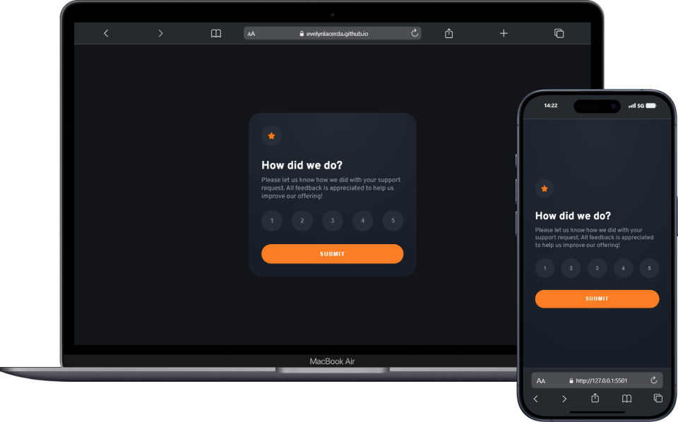

# Rating Component | Frontendmentor

O Rating Component é utilizado para avaliação de um atendimento em um determinado assunto. O projeto foi desenvolvido durante as mentorias do curso DevQuest, afim de fixar conceitos importantes do HTML, CSS e JavaScript.

<h3>

[💻 Click Here to Preview](https://evelynlacerda.github.io/rating-component/)

</h3>
 

### 🚀 Tecnologias Utilizadas:

    
    
    

 
 

